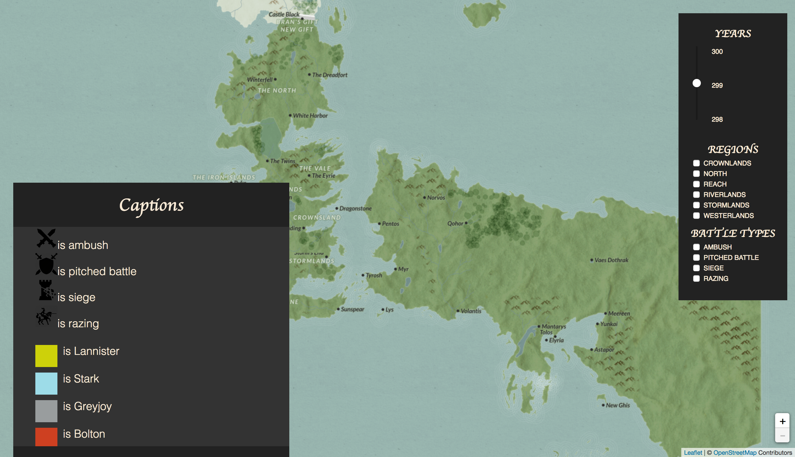

# Game of thrones battle map

Using a web page, this project shows in a map the battles that take place in the *A Song of Ice and Fire* universe. Using [leaflet](http://leafletjs.com), an open-source JavaScript library for interactive maps, and [War of the five kings](https://github.com/chrisalbon/war_of_the_five_kings_dataset) dataset, found through [Kaggle](https://www.kaggle.com/mylesoneill/game-of-thrones), the battles that take place in the years 298, 299 and 300 are painted in the map following [this tutorial](https://blog.patricktriest.com/game-of-thrones-map-node-postgres-redis/) and the project on [triespa's GitHub](https://github.com/triestpa/Atlas-Of-Thrones). To complete the initial dataset, information from [A Wiki of Ice and Fire](http://awoiaf.westeros.org/index.php/Category:Battles) was obtained, extending the note field, including in detail data for each of the battles.

## How does it work?

To be able to execute the system, you need a web browser (Google Chrome, Mozilla Firefox or Safari work perfectly) to view the map. Once you open it, you find the map shown in the following image:

The rightmost panel shows the different options to filter the battles that take place in Westeros between the years 298 and 300. They can be shown by region and battle type. Once you have selected the year and the regions and battle types that you want to be shown, they are painted on the map, as you can see in the image below. The different battle types are represented using different icons, and the battle size by the painted circles in the map. For each battle, there are two circles: one for the attacker army and one for the defender army. The sizes of the circles depend on the size of the armies. To distinguish among the armies, each of the houses involved in the battles are painted in a different color, usually a color that has relation with their emblems or quotes.

The map provides a *Captions* section located on the rightmost corner of the map, in which the color-house correspondance is stated, as well as what each of the icons for the battle types mean. This caption is shown when nothing in the map is selected or when a point without battles is clicked. 

When a battle is selected, information regarding the selected battle is displayed on the rightmost corner of the page. Following the name of the battle, the data obtained from the A Wiki of Ice and Fire is displayed, containing different facts and how the battle took place.

Finally, as we can do on Google Maps and every other Leaflet map, it can be zoomed in and out and we can traverse the map using the mouse.

## What is in this repository?

This project counts with thee files with the source code for the web page and an additional directory, where the images that represent the different battle types are stored:

- **index.html**: this file contains the html code for the web page, structured in different divs which contain the different elements composing the page.
- **index.css**: this file contains the format of the web.
- **index.js**: this file contains the script in charge of painting the different battles on the map, as well as showing them following the user filters selection.
- **icons**: this directory cointains the icons used to represent the different battle types on the map.

## Requirements

It is necessary to use the Leaflet library and a web browser, either Mozilla Firefox or Google Chrome.

## People involved

This project was developed by:

[Silvia Barbero](https://github.com/fyrier)

[Sinclert Pérez](https://github.com/Sinclert)

[Pablo León](https://github.com/PLeon6822)